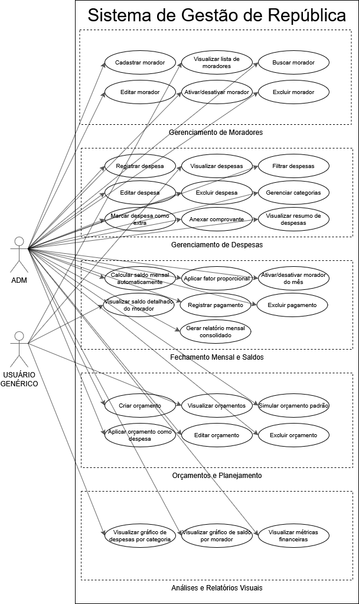

# Histórias de Usuário e Critérios de Aceitação

## Atores do sistema

- **Administrador** — responsável pela gestão da república. Tem acesso completo ao sistema.
- **Morador** — residente da república. Tem acesso apenas à visualização de despesas e rateio.

---

# 👥 EPIC-001: Gerenciamento de Moradores

## US-001.1: Cadastro de Moradores

**História de Usuário:**
Eu, como **administrador**, quero cadastrar novos moradores com suas informações básicas, para que eles possam ser incluídos na caixinha.

**Critério de Aceitação 1 - Cadastro realizado com sucesso:**
Dado que o administrador acessou a tela de gerenciamento de moradores e abriu o formulário de cadastro.
Quando ele preenche o nome completo, um apelido único, o número de WhatsApp (opcional) e seleciona a categoria (Bixo, Agregado, Morador) e clica em "Salvar".
Então o sistema deve validar os dados e persistir o registro no banco de dados MongoDB e exibir uma mensagem de sucesso na interface.

**Critério de Aceitação 2 - Bloqueio de apelido duplicado:**
Dado que o apelido "X" já está cadastrado no sistema.
Quando o administrador tenta salvar um novo morador com o mesmo apelido "X".
Então o sistema deve impedir a persistência e exibir o alerta de erro: "Este apelido já está em uso".

---

## US-001.2: Visualização de Lista de Moradores

**História de Usuário:**
Eu, como **morador ou administrador**, quero visualizar uma lista de todos os moradores, para ter uma visão geral de quem está na república.

**Critério de Aceitação 1 - Exibição da listagem paginada:**
Dado que existem moradores cadastrados no sistema.
Quando o morador navega até a página de moradores.
Então o sistema deve carregar e exibir uma lista paginada utilizando os componentes ResidentCard, mostrando claramente o nome completo, apelido, categoria e o status visual (ativo/inativo) de cada um.

---

## US-001.3: Busca de Moradores

**História de Usuário:**
Eu, como **morador ou administrador**, quero buscar moradores por nome ou apelido, para encontrar rapidamente um morador específico.

**Critério de Aceitação 1 - Busca por correspondência exata ou parcial:**
Dado que o morador está na listagem de moradores que contém o campo de pesquisa.
Quando ele digita um nome ou apelido no campo de busca.
Então a interface deve atualizar dinamicamente chamando o serviço de busca e trazendo apenas os moradores que correspondem ao termo digitado.

---

## US-001.4: Edição de Moradores

**História de Usuário:**
Eu, como **administrador**, quero editar as informações de um morador existente, para manter os dados atualizados.

**Critério de Aceitação 1 - Atualização de dados com sucesso:**
Dado que o administrador selecionou a opção de editar no cartão de um morador.
Quando ele altera as informações desejadas no modal/formulário de edição e clica em "Confirmar".
Então o sistema deve atualizar os dados de forma persistente no MongoBD e atualizar a listagem com as novas informações.

---

## US-001.5: Ativação/Desativação de Moradores

**História de Usuário:**
Eu, como **administrador**, quero ativar ou desativar um morador, para controlar quem participa dos cálculos mensais sem precisar excluí-lo.

**Critério de Aceitação 1 - Alteração de status e impacto nos cálculos:**
Dado que o morador está atualmente listado como "Ativo".
Quando o administrador clica no componente de switch de ativação/desativação no ResidentCard.
Então o sistema deve disparar uma requisição para atualizar o status, alterando a exibição visual para "Inativo" e garantindo que ele não seja contabilizado nos cálculos mensais padrão da caixinha enquanto estiver inativo.

---

## US-001.6: Exclusão de Moradores

**História de Usuário:**
Eu, como **administrador**, quero excluir um morador, para remover permanentemente alguém que não faz mais parte da república.

**Critério de Aceitação 1 - Remoção definitiva com confirmação de segurança:**
Dado que o administrador clicou no botão de exclusão de um morador.
Quando o sistema exibe um modal perguntando "Tem certeza que deseja excluir?" e o administrador clica em "Confirmar".
Então o sistema deve remover permanentemente o registro do banco de dados, remover o morador da tela e exibir um aviso de confirmação.

---

# 💰 EPIC-002: Gerenciamento de Despesas e Categorias

## US-002.1: Registro de Despesas

**História de Usuário:**
Eu, como **administrador**, quero registrar novas despesas com detalhes como descrição, valor, data e categoria, para manter um controle financeiro.

**Critério de Aceitação 1 - Registro com sucesso:**
Dado que o administrador acessou a tela de despesas e abriu o formulário de cadastro.
Quando preenche a descrição, valor, data, seleciona uma categoria válida e clica em "Salvar".
Então o sistema deve rodar a validação dos dados, persistir os dados no banco de dados MongoDB e exibir uma notificação de sucesso.

**Critério de Aceitação 2 - Bloqueio de campos obrigatórios vazios:**
Dado que o formulário de registro está aberto.
Quando o administrador tenta salvar a despesa deixando o campo de "valor" ou "descrição" em branco.
Então o sistema deve impedir o envio do formulário e exibir mensagens de erro destacando os campos obrigatórios.

---

## US-002.2: Visualização de Despesas

**História de Usuário:**
Eu, como **morador ou administrador**, quero visualizar todas as despesas registradas, para acompanhar os gastos da república.

**Critério de Aceitação 1 - Exibição da tabela de despesas:**
Dado que existem despesas previamente salvas no banco de dados.
Quando o morador navega até a página de despesas.
Então o sistema deve renderizar uma tabela contendo a lista paginada de todas as despesas com suas respectivas descrições, valores, datas e categorias cadastradas.

---

## US-002.3: Filtragem de Despesas

**História de Usuário:**
Eu, como **morador ou administrador**, quero filtrar as despesas por categoria, mês e ano, para analisar os gastos de forma mais específica.

**Critério de Aceitação 1 - Aplicação de múltiplos filtros combinados:**
Dado que a listagem de despesas possui dados de vários meses e categorias.
Quando o morador seleciona uma categoria específica (ex: "Alimentação"), o mês e o ano nos componentes de filtro da interface.
Então a tabela deve se atualizar dinamicamente exibindo apenas as despesas que atendam a todos os critérios selecionados em paralelo.

---

## US-002.4: Edição de Despesas

**História de Usuário:**
Eu, como **administrador**, quero editar uma despesa existente, para corrigir informações ou atualizar detalhes.

**Critério de Aceitação 1 - Modificação de dados com persistência:**
Dado que o administrador clicou na opção de edição de uma linha da tabela de despesas.
Quando ele altera dados como o valor ou a categoria no modal de edição e confirma as mudanças.
Então o sistema deve processar a alteração no banco de dados e recarregar a tabela atualizada.

---

## US-002.5: Exclusão de Despesas

**História de Usuário:**
Eu, como **administrador**, quero excluir uma despesa, para remover registros incorretos ou cancelados.

**Critério de Aceitação 1 - Remoção com modal de confirmação:**
Dado que o administrador acionou o botão de exclusão em uma despesa específica.
Quando o sistema exibe um alerta de confirmação e o administrador clica em "Confirmar".
Então o sistema deleta permanentemente a despesa do banco de dados MongoDB, remove a linha correspondente da tela e recalcula os totais imediatamente.

---

## US-002.6: Gerenciamento de Categorias

**História de Usuário:**
Eu, como **administrador**, quero gerenciar as categorias de despesas (adicionar, editar, remover), para organizar melhor os gastos.

**Critério de Aceitação 1 - Cadastro de nova categoria personalizada:**
Dado que o administrador está no painel ou modal de gerenciamento de categorias.
Quando insere um novo nome de categoria (ex: "Manutenção Pool") e salva.
Então o backend processa salvando no banco de dados e a nova opção passa a ficar disponível no campo de seleção de despesas do sistema.

---

## US-002.7: Indicação de Despesa Extra

**História de Usuário:**
Eu, como **administrador**, quero indicar se uma despesa é extra, para que ela seja cobrada separadamente.

**Critério de Aceitação 1 - Marcação de despesa extra:**
Dado que o administrador preencheu os dados comuns de uma nova despesa.
Quando ativa a caixa de seleção indicando "Despesa Extra" antes de clicar em salvar.
Então o atributo `isExtra` deve ser persistido como `true` no modelo do banco de dados, garantindo que esse custo não seja rateado de forma igualitária no fechamento comum.

---

## US-002.8: Upload de Comprovantes (URL)

**História de Usuário:**
Eu, como **administrador**, quero anexar um comprovante (URL) a uma despesa, para ter um registro visual do gasto.

**Critério de Aceitação 1 - Armazenamento e exibição do comprovante:**
Dado que o administrador está inserindo uma URL válida de imagem ou documento no campo de comprovante do formulário.
Quando a despesa é gravada com sucesso.
Então o link é salvo e um ícone ou botão de visualização deve aparecer na linha correspondente da tabela de despesas para abrir o arquivo em uma nova aba.

---

## US-002.9: Resumo de Despesas

**História de Usuário:**
Eu, como **morador ou administrador**, quero visualizar o total de despesas, despesas comuns e despesas extras, para ter um resumo financeiro.

**Critério de Aceitação 1 - Atualização em tempo real dos blocos de resumo:**
Dado que o morador está visualizando o topo da página de despesas.
Quando a tela é carregada ou uma nova despesa é cadastrada.
Então o sistema deve renderizar cards de resumo exibindo de forma clara três métricas calculadas: a soma de todas as despesas, a soma das comuns e a soma das extras daquele período.

---

# 🧠 EPIC-003: Fechamento Mensal e Saldos (Caixinha)

## US-003.1: Cálculo Automático de Saldo Mensal

**História de Usuário:**
Eu, como **administrador**, quero que o sistema calcule automaticamente o saldo mensal de cada morador, considerando todas as despesas e pagamentos.

**Critério de Aceitação 1 - Processamento da divisão de gastos comuns:**
Dado que existem despesas comuns registradas e múltiplos moradores com status ativo no mês corrente.
Quando o sistema carrega os dados ou realiza o fechamento.
Então ele deve somar os gastos comuns, dividir igualmente entre os participantes ativos e calcular de forma exata a cota mensal de cada um.

**Critério de Aceitação 2 - Integração de despesas extras e pagamentos:**
Dado que um morador possui despesas extras vinculadas diretamente a ele e pagamentos parciais já registrados.
Quando o balanço é gerado.
Então o sistema deve atualizar o saldo atual subtraindo os pagamentos e somando as despesas extras ao valor da cota básica.

---

## US-003.2: Fator Proporcional

**História de Usuário:**
Eu, como **administrador**, quero definir um fator proporcional para moradores que não moraram o mês inteiro, para que o cálculo seja justo.

**Critério de Aceitação 1 - Ajuste de cota por permanência parcial:**
Dado que o administrador abriu o painel de ajuste no ResidentBalanceCard de um morador específico.
Quando ele insere um fator proporcional menor que 1 (ex: 0.5 para quem viveu metade do mês) e salva.
Então o back end deve aplicar esse multiplicador sobre a fração de despesas comuns devida por aquele morador, reduzindo-a proporcionalmente.

---

## US-003.3: Ativação/Desativação Mensal de Morador

**História de Usuário:**
Eu, como **administrador**, quero ativar ou desativar um morador para um mês específico, para ajustar a participação nos cálculos.

**Critério de Aceitação 1 - Exclusão pontual de morador do rateio do mês:**
Dado que um morador está ativo no cadastro geral da casa, mas passará um mês inteiro viajando de férias.
Quando o administrador desmarca o switch de status mensal no ResidentBalanceCard para o mês em questão.
Então o backend deve processar a alteração, e a lógica de cálculo deve redistribuir as despesas comuns apenas entre os demais moradores participantes daquele período.

---

## US-003.4: Visualização Detalhada do Saldo Mensal

**História de Usuário:**
Eu, como **morador ou administrador**, quero visualizar o saldo anterior, cota mensal, total devido, valor pago e saldo atual para entender minha situação financeira individual.

**Critério de Aceitação 1 - Exibição transparente das métricas financeiras individuais:**
Dado que o morador acessou a página MonthlyDashboard.
Quando os dados do mês e ano selecionados são carregados do backend.
Então cada bloco ou cartão de morador (ResidentBalanceCard) deve exibir explicitamente os valores de: saldo anterior, cota mensal, total devido, valor pago e saldo atual atualizado.

---

## US-003.5: Registro de Pagamentos

**História de Usuário:**
Eu, como **administrador**, quero registrar pagamentos feitos por moradores, incluindo o valor e um comprovante, para manter o controle dos recebimentos.

**Critério de Aceitação 1 - Lançamento de pagamento com sucesso:**
Dado que o administrador abriu o formulário de inclusão de pagamento no card de um morador.
Quando preenche o valor pago, insere a URL do comprovante correspondente e confirma a operação.
Então o sistema deve realizar o armazenamento e registro no banco de dados e abater o valor do total devido imediatamente na interface.

---

## US-003.6: Exclusão de Pagamentos

**História de Usuário:**
Eu, como **administrador**, quero excluir um pagamento registrado, para corrigir erros.

**Critério de Aceitação 1 - Estorno de pagamento lançado incorretamente:**
Dado que o administrador identificou um pagamento duplicado ou com valor errado na lista de recebimentos de um morador.
Quando ele clica na ação de exclusão do pagamento e confirma o aviso do sistema.
Então o backend deve remover o item, o banco de dados deve ser atualizado e o saldo atual devido do morador deve ser recalculado somando de volta o valor removido.

---

## US-003.7: Relatório Mensal Consolidado

**História de Usuário:**
Eu, como **morador ou administrador**, quero visualizar um relatório mensal consolidado, para ter um resumo financeiro geral da caixinha.

**Critério de Aceitação 1 - Geração e visualização do balancete geral:**
Dado que todas as despesas e pagamentos do período foram devidamente alimentados.
Quando o morador solicita a exibição do fechamento na página do dashboard mensal.
Então deve ser exibido na tela um relatório estruturado contendo o resumo consolidado com o total arrecadado, pendências de caixas anteriores, total de despesas executadas e a taxa geral de adimplência da moradia compartilhada.

---

# 📋 EPIC-004: Orçamentos e Planejamento

## US-004.1: Criação de Orçamentos

**História de Usuário:**
Eu, como **administrador**, quero criar orçamentos mensais para diferentes categorias de despesas, para planejar os gastos futuros.

**Critério de Aceitação 1 - Cadastro de orçamento planejado com sucesso:**
Dado que o administrador está na página Budgets e abriu o formulário de criação.
Quando ele insere a descrição, o valor estimado, seleciona o mês/ano de vigência e a categoria correspondente e clica em "Salvar".
Então o sistema deve registrar e persistir o registro no MongoDB através do BudgetRepository e exibir o planejamento na tela.

---

## US-004.2: Visualização de Orçamentos

**História de Usuário:**
Eu, como **morador ou administrador**, quero visualizar os orçamentos por mês e ano, para acompanhar o planejamento financeiro da república.

**Critério de Aceitação 1 - Filtragem e exibição do planejamento periódico:**
Dado que existem metas de orçamentos previamente cadastradas para diferentes períodos.
Quando o morador seleciona um mês e ano específicos na interface de filtros da página de orçamentos.
Então o backend deve processar e renderizar de forma organizada a lista de orçamentos planejados para aquele período.

---

## US-004.3: Simulação de Orçamento Padrão

**História de Usuário:**
Eu, como **administrador**, quero simular um mês padrão de orçamentos, para ter uma base de planejamento sem precisar preencher tudo manualmente.

**Critério de Aceitação 1 - Replicação automática de orçamentos recorrentes:**
Dado que a república possui uma estrutura de gastos fixos previsíveis mês a mês.
Quando o administrador clica no botão de simulação presente na página de orçamentos para gerar a base de um novo mês.
Então o sistema deve clonar automaticamente os orçamentos do modelo padrão para o período selecionado.

---

## US-004.4: Aplicação de Orçamento como Despesa Real

**História de Usuário:**
Eu, como **administrador**, quero aplicar um orçamento como uma despesa real, para facilitar o registro de gastos planejados.

**Critério de Aceitação 1 - Conversão direta de orçamento planejado em gasto efetivo:**
Dado que um orçamento de conta fixa (ex: "Internet - R$ 150,00") foi cadastrado e a conta chegou.
Quando o administrador clica na ação de "Aplicar como Despesa Real" na linha desse orçamento.
Então o backend deve executar o método, migrando os dados automaticamente para o módulo de despesas comuns sem que seja necessário preencher tudo novamente.

---

## US-004.5: Edição e Exclusão de Orçamentos

**História de Usuário:**
Eu, como **administrador**, quero editar e excluir orçamentos, para ajustar o planejamento conforme necessário.

**Critério de Aceitação 1 - Edição de metas financeiras:**
Dado que o preço de um serviço planejado sofreu reajuste.
Quando o administrador altera o valor limite do orçamento e clica em salvar.
Então o sistema atualiza o registro no banco.

**Critério de Aceitação 2 - Exclusão de planejamento:**
Dado que uma categoria de gasto foi cancelada pela casa.
Quando o administrador clica no botão de exclusão e confirma a intenção.
Então o registro é permanentemente removido e a listagem visual é atualizada.

---

# 📊 EPIC-005: Análises e Relatórios Visuais

## US-005.1: Gráfico de Despesas por Categoria

**História de Usuário:**
Eu, como **morador ou administrador**, quero visualizar gráficos de despesas por categoria, para identificar onde o dinheiro está sendo gasto.

**Critério de Aceitação 1 - Renderização correta do gráfico de distribuição de gastos:**
Dado que existem despesas salvas associadas a diferentes categorias no banco de dados.
Quando o morador navega até a página Analytics.
Então o frontend deve consumir o endpoint de agrupamento por período e categoria e renderizar um gráfico (pizza ou barras), exibindo a porcentagem ou valor total de cada categoria de forma visualmente clara.

---

## US-005.2: Gráfico de Saldo Restante por Morador

**História de Usuário:**
Eu, como **morador ou administrador**, quero visualizar um gráfico de barras com o saldo restante por morador, para ter uma visão rápida de quem deve.

**Critério de Aceitação 1 - Identificação ágil de inadimplência ou pendências:**
Dado que o processamento financeiro do mês gerou saldos devedores ou credores para os moradores.
Quando o morador abre o painel de análises gráficas.
Então o sistema deve fazer uma requisição ao endpoint responsável por retornar o saldo restante individual do mês selecionado e exibir um gráfico de barras horizontal, ordenando ou destacando os moradores que possuem valores pendentes de pagamento.

---

## US-005.3: Métricas Financeiras Resumidas

**História de Usuário:**
Eu, como **morador ou administrador**, quero ver métricas financeiras como total de despesas, despesas comuns, despesas extras, total cobrado e adimplência, para ter um resumo do desempenho financeiro da república.

**Critério de Aceitação 1 - Exibição consolidada dos indicadores de desempenho da casa:**
Dado que o ecossistema financeiro da república possui dados consolidados de despesas e pagamentos efetuados.
Quando a página Analytics é carregada pelo morador.
Então o backend deve processar a rota de métricas globais e renderizar cards informativos contendo os valores absolutos do total de despesas, a segmentação de custos comuns/extras, o montante faturado global e a taxa percentual de adimplência da república naquele período.

# Diagrama de Casos de Uso

